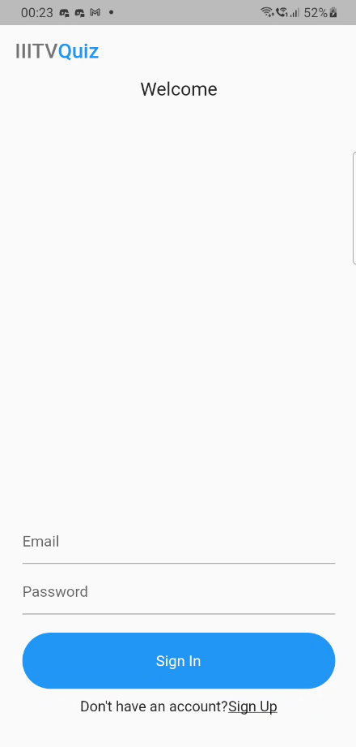
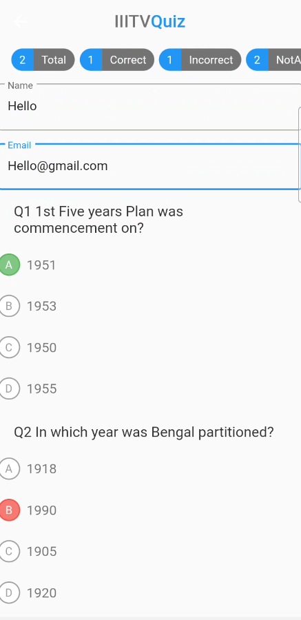
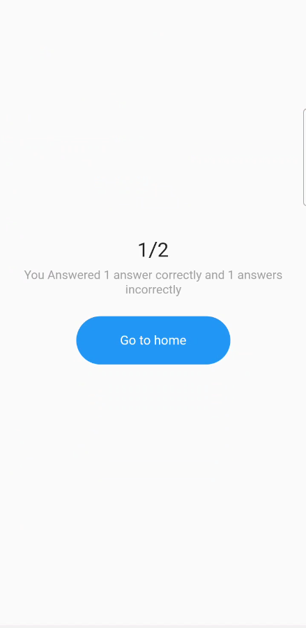

# quiz_app

Since The EBSB Club conducts Its Monthly Quizes on Google Form I thought It would be better to have a particular platform, So I made this Quiz App using Flutter and Firbebase to ease the Process.

# Discription

First you login with your google account and than there are some quizes previously uploded now anyone can add questions for that i created a Create Quiz Page which is the major backend activity to upload and add question.

# ScreenShots

    </img> 
    </img> 
    </img> 
     
    </img> 
    </img> 
    </img> 

 
